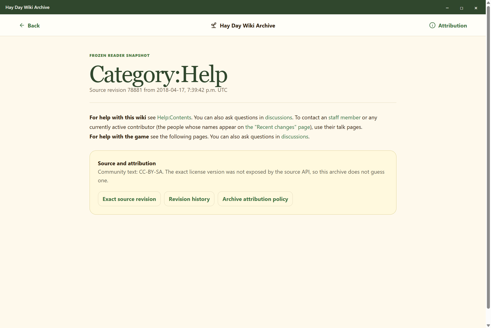

# Hay Day Wiki Archive

An unofficial, read-only archive and reader for the reader-facing knowledge base at [Hay Day Wiki](https://hayday.fandom.com/wiki/Hay_Day_Wiki). The project is intended to preserve a reproducible snapshot with source revisions, attribution, media provenance, and a calm farm-guide reading experience.

> **Status:** The complete reader-facing snapshot and static archive are published. The repository contains 1,362 article records and 3,708 referenced media records. The Windows desktop package is implemented, packaged, and exercised through the required hidden-desktop route.

[Download Hay Day Wiki Archive 0.1.0 for Windows](https://github.com/Ding-Ding-Projects/hay-day-wiki-archive/releases/download/v0.1.0/Hay-Day-Wiki-Archive-0.1.0-Setup.exe). The installer is unsigned and may trigger an unknown-publisher or SmartScreen warning. [Release notes and package files](https://github.com/Ding-Ding-Projects/hay-day-wiki-archive/releases/tag/v0.1.0) are published with byte sizes and SHA-256 digests.

## Start here

- [Archive scope and exclusions](docs/content/archive-scope.md)
- [Import and provenance model](docs/content/import-and-provenance.md)
- [Media rights and storage matrix](docs/media/media-rights-matrix.md)
- [Universal feature completeness inventory](docs/architecture/feature-completeness.md)
- [Material Design reference handoff](design/README.md)
- [Roadmap](ROADMAP.md)
- [Handoff](HANDOFF.md)

The public reader is <https://ding-ding-projects.github.io/hay-day-wiki-archive/>. It is a read-only documentation surface, not a replacement community site, not a game client, and not a place for accounts, editing, comments, or discussion records.

Published reader home and Windows download

This real capture came from the deployed reader at commit `6d35d3657ca129f98f53677803218e99ccc0b7e9` through an isolated hidden desktop. It is 1,440 × 1,000 pixels, 467,657 bytes, and has SHA-256 `f0cb0567d1e52605759a4962c39dfcbc3a0dec037973cbff2d89505f255aea90`. The download control was exercised separately at a 390 × 844 touch viewport and returned the exact 166,193,664-byte setup executable with HTTP 200.

## Verified snapshot

The execution manifest records these published figures:

| Collection | Count | Meaning |
| --- | ---: | --- |
| Reader-facing included records | 1,362 | 994 main-namespace articles and redirects, 11 project records, 3 Help records, and 354 categories |
| Main-namespace articles and redirects | 994 | Reader-facing article records found during planning |
| Categories | 354 | Category routes and membership records found during planning |
| Help records | 3 | Help and project guidance records found during planning |
| Hay Day Wiki project records | 11 | Project-policy records found during planning |
| Referenced media records | 3,708 | Distinct media identities referenced by the frozen reader content |
| External embed records | 29 | Consent-gated provider references represented in the media ledger |
| File-namespace records | 4,682 | File namespace records reported during planning |
| All-images media records | 4,634 | All-images inventory records reported during planning, distinct from the file namespace |
| Original media volume | About 1.898 GiB | Source-reported original media volume |

The execution-time manifest is the source of truth. Its content digest is `05efa4bafc434ca566664ed1c07dfde80856f6d55b67fedd9d0a974ddd71b3c3`; its media digest is `9359ae3d389c0186e1234cc56640a221b2d72925a1ee0c513d7f474897505c61`.

## Attribution and rights

Imported community-authored text remains attributed to its original authors and source revision. Where source evidence establishes the applicable terms, the importer records the exact license identifier and version before publishing an adaptation. The planning audit points to CC BY-SA evidence, but the execution manifest must capture the exact version from the source rather than assume it. The article carries the original title, revision permalink, history link, import time, and transformation note.

Media rights are evaluated per file. A media record can be preserved without copying its bytes when reuse rights are not established. The archive never guesses a license, silently changes a file, or presents a source-hosted file as a local copy. See the [media rights matrix](docs/media/media-rights-matrix.md).

This project is unofficial and is not endorsed by Supercell. Hay Day and Supercell remain the property of their respective owners. The project is non-commercial, has no advertising or analytics, and does not provide public editing or community accounts. See [Supercell's Fan Content Policy](https://supercell.com/en/fan-content-policy/).

## Media storage

The public reader will keep the static application and manifests below the GitHub Pages published-size limit. Eligible, verified original media will use immutable release-backed Cheap LFS assets. Standard Git LFS is not used. External videos remain external references and are never presented as copied local media.

Every media record receives one terminal decision: `copied`, `external-embed`, `source-link-only`, or `missing-upstream`. The manifest stores the source identity, rights classification, digest, dimensions, MIME type, byte size, and immutable storage URL where applicable.

## Build and run

On Windows, run `build.bat /s` to install declared dependencies when needed, build the static reader, verify its 5,077-route output, and produce the unpacked desktop application. Run `build-installer.bat /s` to produce and verify the genuine unsigned Squirrel.Windows installer files. The installer is intentionally unsigned and may trigger an unknown-publisher warning.

Release `v0.1.0` publishes the verified installer at commit `db5fb72fa280da86d7a0f65eda460c5e981d4a7e`. Its setup executable is 166,193,664 bytes with SHA-256 `a0c4b90f06adc716151c800a6a0beb1891e91d5e5269bb6b8d42deb499777f1c`.

The desktop reader bundles the same static snapshot as the public reader. It serves those files on an ephemeral loopback port, requires a launch-specific HttpOnly session cookie, prevents path traversal, applies a restrictive content security policy, keeps Node.js out of renderer pages, and opens only approved HTTPS source links externally. See [Desktop reader architecture](docs/architecture/desktop-reader.md).

Built desktop reader capture

The capture came from the packaged application built at commit `f2f8df109084f6985785c01125eced55647a9c88` on an isolated hidden desktop. Its SHA-256 is `a7dedc3c192545ce56db9a350352d36d5e1b56d3a288aef4110eb8638639297a`.

The repository keeps a hand-written [feature completeness inventory](docs/architecture/feature-completeness.md). Rows marked `Unimplemented` are deliberate, factual placeholders. They are not a promise that a hidden route or sibling project satisfies the requirement.

## Project size

The committed `node scripts/count-lines.mjs` counter reports the following values for the first desktop-reader candidate:

| Area | Files | Lines | Non-blank lines |
| --- | ---: | ---: | ---: |
| Source | 88 | 9,890 | 9,115 |
| Tests | 3 | 355 | 340 |
| Styles and markup | 28 | 834 | 601 |
| Generated snapshot | 5,073 | 1,086,526 | 1,086,526 |
| Other repository content | 19 | 16,019 | 15,976 |

The human implementation estimate is **approximately 5 to 11 developer-months**. Method: 10,056 non-blank source, test, style, and markup lines at 60 to 120 reviewed lines per working day, multiplied by 1.35 for importer, rights, static-routing, security, packaging, and accessibility complexity, then divided by 21 working days per month. This is an estimate, not measured history. Generated snapshot records, installed dependencies, build output, and lockfiles are excluded.

## License

Implementation code is intended to use the MIT License. Imported text is handled under its source terms, with the exact license version recorded from source evidence. Media rights remain file-specific. See [LICENSE](LICENSE) and [docs/content/licensing-and-attribution.md](docs/content/licensing-and-attribution.md).
